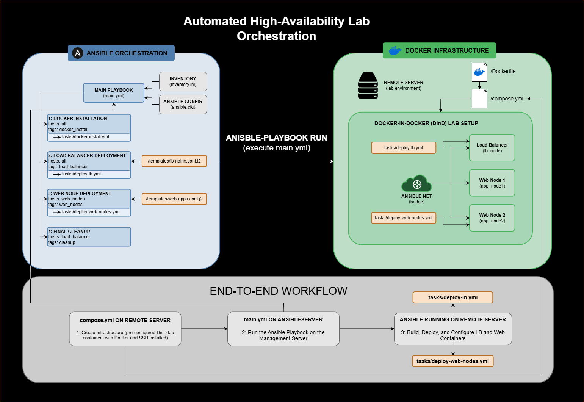

# Automated High-Availability Lab Orchestration

A Senior Capstone project demonstrating automated infrastructure deployment using Ansible and Docker-in-Docker (DinD).

## Project Overview
This project automates the deployment of a high-availability web cluster. It uses Ansible to orchestrate a custom Nginx Load Balancer and multiple web application nodes within a simulated environment.

## The Goal
To demonstrate how Infrastructure-as-Code (IaC) can manage complex network topologies and service redundancy without the overhead of multiple physical or cloud-based virtual machines.

## Key Features
* **Infrastructure-as-Code:** Full lifecycle management from system bootstrapping to service deployment.
* **Dynamic Load Balancing:** Automated Nginx configuration using Jinja2 templates that scale based on the Ansible inventory.
* **Simulated Multi-Node Environment:** Utilizes a "Docker-in-Docker" (DinD) architecture to mimic remote managed nodes.
* **High Availability:** Implemented round-robin traffic distribution with easy "stop/start" management playbooks.

## Architecture
- **Ansible Control Plane:** Manages configuration via Playbooks and Jinja2 templates.
- **Docker-in-Docker (DinD):** Simulates remote managed nodes as containers to avoid cloud costs.
- **Load Balancer:** Custom Nginx build with dynamic upstream configuration.

## Architecture Diagram


## Setup & Prerequisites
This project requires a Control Machine (where Ansible is installed) and a Target Host (where the lab environment will run).
1. The Management Control Machine (Your PC/Laptop):
The Control Machine must be a Unix-like system (Linux or macOS). Windows users should use WSL2.

   #### Ubuntu/Debian
    ```
    sudo apt update && sudo apt install ansible -y
   ```

   #### macOS (Homebrew)
   ```
   brew install ansible
   ```

   #### SSH Key Generation: Ansible communicates via SSH. You need a key pair:
   ```
   ssh-keygen -t rsa -b 4096
   ```
   
Note: Remember the path to your public key (usually ~/.ssh/id_rsa.pub).

2. The Target Remote Server

This is the machine where the simulated lab will live.

    Docker Requirement: The target machine must have Docker and the Docker Compose plugin installed before you begin.

    SSH Configuration:

        Copy your public key string from your Control Machine.

        Open remote-server/Dockerfile in this repository.

        Find the RUN echo "ssh-rsa ..." line and replace the example string with your actual public key.
        This allows the Ansible Control Machine to "log in" to the simulated containers.

3. Project Configuration

Inventory: Open inventory.ini and update ansible_host with the actual IP address of your Target Remote Server.

    Connectivity Test: Ensure you can ping the target server from your control machine.
## Execution Flow
1.  **Initialize Lab:** `docker compose up -d` (This creates the simulated "servers").
2.  **Deploy Stack:** `ansible-playbook main.yml` (This configures the servers and starts the apps).
3.  **Manage Apps:** Use `ansible-playbook manage-apps.yml -e "target_state=stop"` to test failover.

## Post-Deployment Management

Deploying the infrastructure is only the first step. This project includes a management playbook, `manage-apps.yml`, which allows you to control the lifecycle of the web applications individually or at scale.

#### Managing Web Nodes
This playbook uses variables to target specific containers and set their state.

**Command Syntax:**
```
ansible-playbook manage-apps.yml -e "target_app=<container_name> target_state=<state>"
```

## Resetting the Environment
To return to a clean "Day 0" state:
```
docker compose down
docker compose up -d
```

## Logic Flow
1. **Bootstrap:** Install Docker engine and Python dependencies on all simulated nodes.
2. **Web Deployment:** Provision Nginx web containers with unique identifiers.
3. **LB Integration:** Build the custom Load Balancer image and deploy it to the bridge network.
4. **Cleanup:** Execute a prune task to remove unused build layers and maintain host storage.
